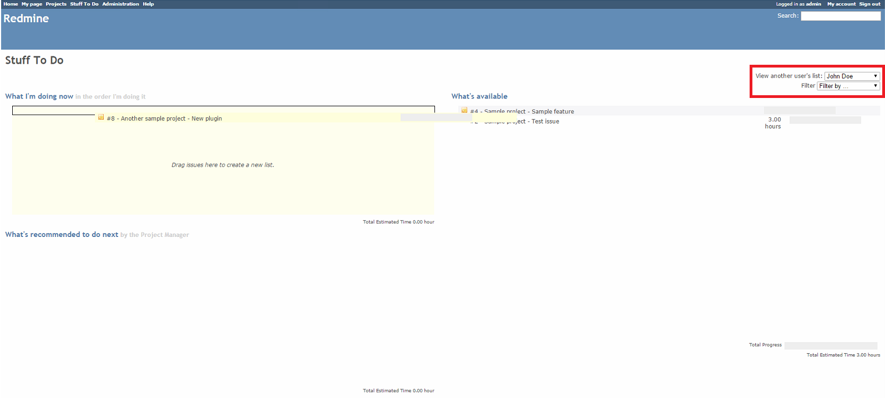
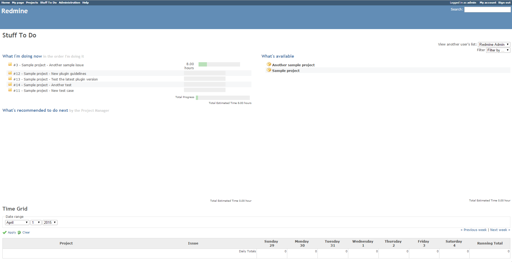

# Redmine Stuff To Do Plugin

This plugin allows Redmine users to prioritize tasks and arrange the assigned issues and projects in a specific order. It also allows administrators and managers to manage other users' workload.

The initial author is [Eric Davis](https://github.com/edavis10).

This plugin provides a number of useful features for Redmine issue management:

* Sorting and prioritizing of cross-project to-do lists
* Editing other users' lists for administrators
* Filtering of issues based on user, priority, status, or project
* Notification emails based on low workload
* Easy-to-use drag-and-drop interface
* Drag-and-drop time logging using the time grid

## Installation

1. To install the plugin
    * Download the .ZIP archive, extract files and copy the plugin directory into #{REDMINE_ROOT}/plugins/stuff_to_do_plugin
    
    Or

    * Change you current directory to your Redmine root directory:  

            cd {REDMINE_ROOT}
            
      Copy the plugin from GitHub using the following commands:
      
            git clone https://github.com/Undev/redmine-stuff-to-do-plugin.git plugins/stuff_to_do_plugin
            
2. This plugin requires a migration. Run the following command to upgrade your database (make a database backup before):  

        bundle exec rake redmine:plugins:migrate RAILS_ENV=production
            
3. Restart Redmine.

Now you should be able to see the plugin in **Administration > Plugins**.

## Usage

The plugin adds the **Stuff To Do** link to the top menu in Redmine.

The **Stuff To Do** link leads to a page with three panes:    

#### What I'm doing now

This pane lists 5 items a user is supposed to be working on. These should be the most important issues assigned to the user. As the user closes an issue (by specifying the **Closed** status or archiving a project), the next item is automatically moved to the top of the list in this pane.

#### What's recommended to do next

This pane lists extra issues used as overflow for the **What I'm doing now** pane.

#### What's available

This pane lists all the open issues assigned to the user or the projects visible to the user.

#### Workflow

The standard workflow for this plugin is as follows:  

1. A user drags items from the **What's available** pane to the **What I'm doing now** and **What's recommended to do next** panes
2. The user prioritizes and sorts the items in the **What I'm doing now** and **What's recommended to do next** panes
3. The user works on the first item (at the top of the **What I'm doing now** list)
4. After the first item is complete (or blocked), the user proceeds to the second item

The Redmine administrator can also edit other users' lists:  

#### Configuration

The plugin can send email notifications when the number of recommended items for a user reaches a certain threshold value (by default, 1). To change this value, go to **Administration > Plugins**, and click **Configure**.  

You can also configure what data should be displayed as the list items on the **Stuff To Do** page and enable/disable the time grid.  

## License

This plugin is licensed under the GNU GPL v2. See COPYRIGHT.txt and GPL.txt for details.